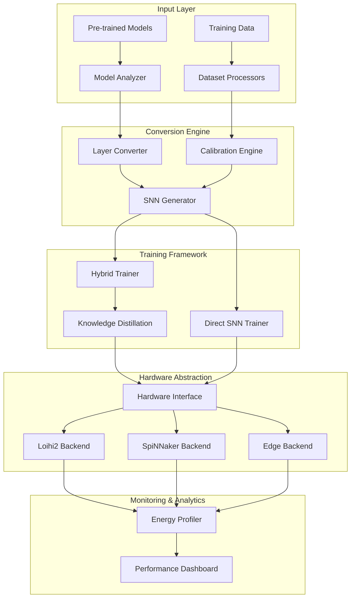

# SpikeFormer Architecture

## System Overview

SpikeFormer is a comprehensive neuromorphic computing toolkit that enables efficient conversion and deployment of transformer models to spiking neural networks. The architecture follows a modular design with clear separation between conversion, training, deployment, and monitoring concerns.

## High-Level Architecture



## Core Components

### 1. Conversion Engine
**Purpose**: Transform ANN models to equivalent SNN representations

**Components**:
- `LayerConverter`: Handles specific layer type conversions
- `ThresholdCalibrator`: Optimizes firing thresholds using calibration data
- `SurrogateGradient`: Enables backpropagation through spike functions
- `ArchitectureValidator`: Ensures converted models maintain structural integrity

**Key Algorithms**:
- Threshold balancing for optimal spike distribution
- Percentile-based weight scaling
- Temporal dimension expansion for spike trains

### 2. Spiking Neural Network Core
**Purpose**: Implement efficient spiking operations and neuron models

**Components**:
- `SpikingAttention`: Memory-efficient spiking self-attention mechanism
- `SpikingMLP`: Feed-forward networks with temporal dynamics
- `LifNeuron`: Leaky Integrate-and-Fire neuron implementation
- `TemporalBatchNorm`: Normalization adapted for spike trains

**Data Flow**:
```python
Input → Spike Encoding → Temporal Processing → Spike Accumulation → Output
```

### 3. Hardware Abstraction Layer
**Purpose**: Provide unified interface across neuromorphic platforms

**Interface**:
```python
class NeuromorphicBackend:
    def compile(self, model: SpikingModel) -> CompiledModel
    def deploy(self, compiled_model: CompiledModel) -> DeployedModel
    def execute(self, deployed_model: DeployedModel, input_data) -> Results
    def profile(self, execution_context) -> EnergyMetrics
```

**Implementations**:
- **Loihi2Backend**: Intel Loihi 2 with NxSDK integration
- **SpiNNakerBackend**: SpiNNaker2 with sPyNNaker interface
- **EdgeBackend**: Generic edge neuromorphic devices

### 4. Energy Profiling System
**Purpose**: Measure and optimize energy consumption

**Components**:
- `PowerMonitor`: Real-time power measurement
- `EnergyAnalyzer`: Statistical analysis of consumption patterns
- `OptimizationEngine`: Automated energy optimization
- `ComparisonFramework`: Baseline comparisons with GPU/CPU

## Data Models

### Spike Tensor
```python
class SpikeTensor:
    """5D tensor: [batch, time, channels, height, width]"""
    data: torch.Tensor  # Binary spike data
    timesteps: int      # Temporal dimension
    dt: float          # Time step duration
    metadata: Dict     # Encoding information
```

### Model Configuration
```python
class SpikingConfig:
    timesteps: int = 32
    threshold: float = 1.0
    neuron_model: str = "LIF"
    spike_encoding: str = "rate"
    surrogate_gradient: str = "fast_sigmoid"
    hardware_constraints: Dict = None
```

## Security Architecture

### Model Protection
- Model checksum validation during conversion
- Encrypted model serialization for proprietary models
- Access control for hardware deployment

### Hardware Security
- Secure boot verification for neuromorphic chips
- Encrypted communication channels
- Tamper detection for edge deployments

### Data Privacy
- Differential privacy for training data
- Federated learning capabilities
- Local inference without data transmission

## Performance Considerations

### Memory Optimization
- Sparse spike representation to minimize memory usage
- Gradient checkpointing for large models
- Dynamic batching based on hardware constraints

### Compute Optimization
- JIT compilation for custom CUDA kernels
- Vectorized operations for spike processing
- Hardware-specific optimization passes

### Network Optimization
- Model pruning for reduced network size
- Quantization-aware training for edge deployment
- Knowledge distillation for accuracy preservation

## Scalability Design

### Horizontal Scaling
- Multi-chip deployment strategies
- Distributed training across multiple nodes
- Load balancing for inference requests

### Vertical Scaling
- Memory-efficient model architectures
- Progressive model loading
- Dynamic resource allocation

## Deployment Patterns

### Edge Deployment
```
Model Training → Optimization → Compilation → Edge Package → Device Deployment
```

### Cloud Deployment
```
Model Training → Containerization → Orchestration → Auto-scaling → Monitoring
```

### Hybrid Deployment
```
Cloud Training → Edge Compilation → Local Deployment → Cloud Monitoring
```

## Quality Attributes

### Reliability
- Graceful degradation under hardware failures
- Automatic model recovery mechanisms
- Comprehensive error handling and logging

### Maintainability
- Plugin architecture for new hardware backends
- Extensive test coverage and CI/CD integration
- Clear separation of concerns and modular design

### Performance
- Sub-second model conversion for small models
- Real-time inference on neuromorphic hardware
- Efficient energy utilization across platforms

### Security
- Secure model distribution and deployment
- Runtime integrity verification
- Protection against adversarial attacks

## Technology Stack

### Core Framework
- **PyTorch**: Deep learning framework
- **NumPy**: Numerical computations
- **SciPy**: Scientific computing

### Hardware Interfaces
- **NxSDK**: Intel Loihi 2 software stack
- **sPyNNaker**: SpiNNaker interface
- **Custom APIs**: Edge device integration

### Monitoring & Analytics
- **Prometheus**: Metrics collection
- **Grafana**: Visualization dashboard
- **MLflow**: Experiment tracking

### Development Tools
- **Docker**: Containerization
- **Kubernetes**: Orchestration
- **GitHub Actions**: CI/CD pipeline