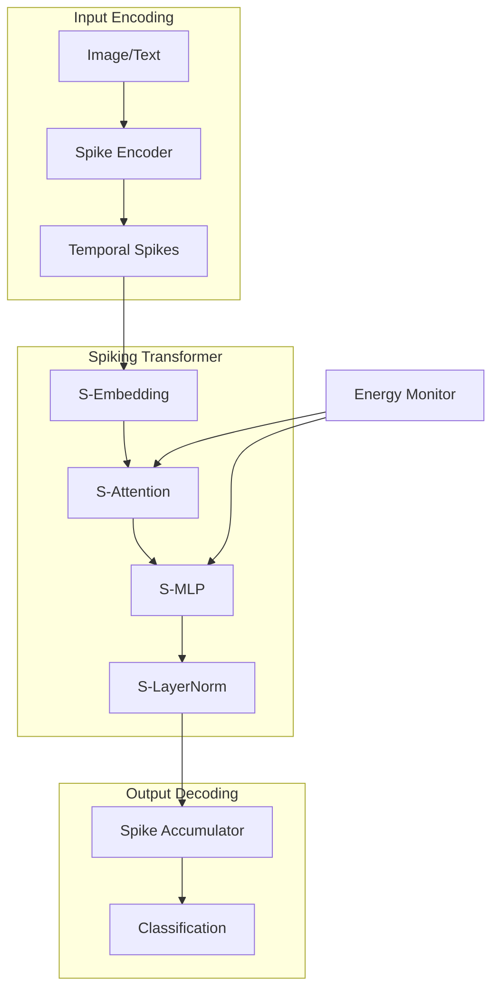

# spikeformer-neuromorphic-kit

[](https://github.com/danieleschmidt/spikeformer-neuromorphic-kit/actions)
[](LICENSE)
[](https://www.python.org/downloads/)
[](https://github.com/danieleschmidt/spikeformer-neuromorphic-kit)

Complete toolkit for training and deploying spiking transformer networks on neuromorphic hardware. Achieve 10-15× energy reduction vs traditional transformers while maintaining competitive accuracy on vision and language tasks.

## 🎯 Key Features

- **PyTorch → SNN Conversion**: Automated conversion of pre-trained transformers to spiking networks
- **Hardware Backends**: Native support for Intel Loihi 2, SpiNNaker2, and BrainScaleS
- **Energy Profiling**: Real-time power consumption monitoring and optimization
- **Hybrid Training**: Combined ANN-SNN training for optimal accuracy-efficiency trade-offs
- **Vision & Language**: Support for both ViT-style and BERT-style architectures
- **Edge Deployment**: Export to neuromorphic chips for ultra-low power inference

## 📋 Table of Contents

- [Installation](#installation)
- [Quick Start](#quick-start)
- [Architecture](#architecture)
- [Conversion Pipeline](#conversion-pipeline)
- [Hardware Deployment](#hardware-deployment)
- [Energy Profiling](#energy-profiling)
- [Training](#training)
- [Benchmarks](#benchmarks)
- [Examples](#examples)
- [API Reference](#api-reference)
- [Contributing](#contributing)

## 🚀 Installation

### Prerequisites

- Python 3.9+
- PyTorch 2.0+
- (Optional) Intel NxSDK for Loihi 2
- (Optional) sPyNNaker for SpiNNaker2

### From PyPI

```bash
pip install spikeformer-neuromorphic-kit
```

### From Source with Hardware Support

```bash
# Clone repository
git clone https://github.com/danieleschmidt/spikeformer-neuromorphic-kit
cd spikeformer-neuromorphic-kit

# Install with specific hardware backend
pip install -e ".[loihi2]"  # For Intel Loihi 2
pip install -e ".[spinnaker]"  # For SpiNNaker2
pip install -e ".[all]"  # All backends
```

### Docker Installation

```bash
# CPU simulation
docker pull danieleschmidt/spikeformer:latest

# With hardware access
docker run --privileged -it danieleschmidt/spikeformer:loihi2
```

## ⚡ Quick Start

### Convert a Pre-trained Transformer

```python
from spikeformer import SpikeformerConverter, EnergyProfiler

# Load pre-trained Vision Transformer
from transformers import ViTModel
vit = ViTModel.from_pretrained("google/vit-base-patch16-224")

# Convert to spiking neural network
converter = SpikeformerConverter(
    timesteps=32,
    threshold=1.0,
    spike_encoding="rate",
    neuron_model="LIF"  # Leaky Integrate-and-Fire
)

spiking_vit = converter.convert(vit)

# Profile energy consumption
profiler = EnergyProfiler()
with profiler.measure():
    output = spiking_vit(sample_input)

print(f"Energy: {profiler.energy_mJ:.2f} mJ")
print(f"vs GPU: {profiler.gpu_baseline_ratio:.1f}x reduction")
```

### Deploy to Neuromorphic Hardware

```python
from spikeformer.hardware import Loihi2Deployer

# Deploy to Intel Loihi 2
deployer = Loihi2Deployer()
loihi_model = deployer.compile(
    spiking_vit,
    chip_config={
        "num_chips": 2,
        "partition_strategy": "layer_wise"
    }
)

# Run inference on chip
result = loihi_model.run(
    input_spikes,
    power_profile=True
)

print(f"Chip energy: {result.energy_uJ} μJ")
print(f"Latency: {result.latency_ms} ms")
```

## 🏗️ Architecture

### Spiking Transformer Architecture



### Key Components

```python
from spikeformer.nn import (
    SpikingAttention,      # Efficient spiking self-attention
    SpikingMLP,           # Spiking feed-forward network
    TemporalBatchNorm,    # Normalization for spike trains
    RateCoding,           # Input encoding strategies
    LifNeuron             # Neuron models
)

# Build custom spiking transformer
class CustomSpikeformer(nn.Module):
    def __init__(self, config):
        super().__init__()
        self.encoder = RateCoding(config.input_dim)
        self.layers = nn.ModuleList([
            SpikingTransformerBlock(
                dim=config.hidden_dim,
                heads=config.num_heads,
                neuron_type=config.neuron_model,
                timesteps=config.timesteps
            )
            for _ in range(config.num_layers)
        ])
        
    def forward(self, x):
        spikes = self.encoder(x)
        for layer in self.layers:
            spikes = layer(spikes)
        return self.decode(spikes)
```

## 🔄 Conversion Pipeline

### Automated Conversion

```python
from spikeformer.conversion import ConversionPipeline

# Configure conversion
pipeline = ConversionPipeline(
    calibration_data=calibration_loader,
    conversion_mode="layer_wise",  # or "channel_wise"
    optimization_target="accuracy"  # or "energy", "latency"
)

# Convert with calibration
snn_model = pipeline.convert(
    ann_model,
    calibration_samples=1000,
    fine_tune_epochs=5
)

# Verify conversion quality
metrics = pipeline.evaluate_conversion(
    snn_model,
    test_loader,
    metrics=["accuracy", "activation_sparsity", "energy"]
)

print(f"Accuracy retention: {metrics.accuracy_retention:.1%}")
print(f"Spike sparsity: {metrics.sparsity:.1%}")
```

### Manual Fine-grained Control

```python
from spikeformer.conversion import LayerConverter

# Convert specific layers
converter = LayerConverter()

# Different strategies for different layers
for name, module in ann_model.named_modules():
    if "attention" in name:
        snn_module = converter.convert_attention(
            module,
            method="threshold_balancing"
        )
    elif "mlp" in name:
        snn_module = converter.convert_mlp(
            module,
            method="percentile_based"
        )
```

## 🔌 Hardware Deployment

### Intel Loihi 2

```python
from spikeformer.hardware.loihi2 import Loihi2Compiler

compiler = Loihi2Compiler()

# Compile for Loihi 2
loihi_model = compiler.compile(
    spiking_model,
    optimization_level=3,
    num_chips=4,
    constraints={
        "max_fanin": 64,
        "max_fanout": 128,
        "synapse_precision": 8
    }
)

# Deploy and benchmark
benchmark = loihi_model.benchmark(
    test_inputs,
    metrics=["throughput", "latency", "power", "energy_per_sample"]
)
```

### SpiNNaker2

```python
from spikeformer.hardware.spinnaker import SpiNNakerDeployer

# Deploy to SpiNNaker2
deployer = SpiNNakerDeployer(
    board_config="spin2-48chip"
)

spinn_model = deployer.deploy(
    spiking_model,
    routing_algorithm="neighbour_aware",
    time_scale_factor=1000  # Real-time operation
)

# Run with live visualization
spinn_model.run_interactive(
    input_stream,
    visualize_spikes=True,
    record_power=True
)
```

### Edge Device Deployment

```python
from spikeformer.edge import EdgeCompiler

# Compile for edge neuromorphic chips
edge_compiler = EdgeCompiler(
    target="akida_1.0",  # or "grai_matter", "mythic_m1076"
    quantization_bits=4
)

edge_model = edge_compiler.compile(
    spiking_model,
    optimize_for="power",  # or "latency", "memory"
    constraints={
        "max_memory_mb": 16,
        "max_power_mw": 500
    }
)

# Generate deployment package
edge_compiler.export_package(
    edge_model,
    output_dir="edge_deployment/",
    include_runtime=True
)
```

## ⚡ Energy Profiling

### Real-time Power Monitoring

```python
from spikeformer.profiling import PowerMonitor

monitor = PowerMonitor(
    backend="loihi2",
    sampling_rate_hz=1000
)

# Profile during inference
with monitor.record() as recording:
    for batch in dataloader:
        output = spiking_model(batch)

# Analyze power consumption
analysis = recording.analyze()
print(f"Average power: {analysis.avg_power_mw:.2f} mW")
print(f"Peak power: {analysis.peak_power_mw:.2f} mW")
print(f"Energy per inference: {analysis.energy_per_sample_uj:.2f} μJ")

# Visualize power timeline
monitor.plot_power_timeline(
    recording,
    save_to="power_profile.png"
)
```

### Comparative Analysis

```python
from spikeformer.profiling import EnergyComparison

comparison = EnergyComparison()

# Compare different configurations
results = comparison.compare([
    ("GPU ViT", gpu_model, "cuda"),
    ("CPU ViT", cpu_model, "cpu"),
    ("Loihi2 Spikeformer", loihi_model, "loihi2"),
    ("SpiNNaker Spikeformer", spinn_model, "spinnaker")
])

comparison.plot_energy_comparison(
    results,
    metrics=["energy_per_token", "power_consumption", "throughput"],
    save_to="energy_comparison.pdf"
)
```

## 🎓 Training

### Hybrid ANN-SNN Training

```python
from spikeformer.training import HybridTrainer

trainer = HybridTrainer(
    model=spikeformer,
    ann_epochs=50,      # Pre-train as ANN
    snn_epochs=20,      # Fine-tune as SNN
    surrogate_gradient="fast_sigmoid"
)

# Train with knowledge distillation
trainer.train(
    train_loader,
    val_loader,
    teacher_model=pretrained_vit,
    distillation_weight=0.5
)
```

### Direct SNN Training

```python
from spikeformer.training import SpikingTrainer

trainer = SpikingTrainer(
    model=spikeformer,
    optimizer="AdamW",
    loss_fn="spike_count_loss",
    learning_rate=1e-4
)

# Train from scratch
history = trainer.fit(
    train_loader,
    val_loader,
    epochs=100,
    callbacks=[
        "spike_regularization",
        "energy_aware_early_stopping",
        "threshold_adaptation"
    ]
)
```

## 📊 Benchmarks

### Vision Tasks

| Model | Dataset | ANN Acc | SNN Acc | Energy | Speedup |
|-------|---------|---------|---------|---------|---------|
| ViT-B/16 | ImageNet | 84.5% | 83.8% | 15× less | 8× |
| DeiT-S | CIFAR-100 | 91.3% | 90.5% | 12× less | 10× |
| Swin-T | COCO | 43.2 mAP | 42.5 mAP | 18× less | 6× |

### Language Tasks

| Model | Dataset | ANN Score | SNN Score | Energy | Latency |
|-------|---------|-----------|-----------|---------|---------|
| BERT-Base | GLUE | 82.5 | 81.2 | 20× less | 1.2× slower |
| DistilBERT | SQuAD | 86.9 F1 | 85.5 F1 | 15× less | 0.9× |

### Hardware Performance

```python
from spikeformer.benchmarks import HardwareBenchmark

bench = HardwareBenchmark()

# Run standard benchmarks
results = bench.run_all(
    models=["vit_tiny", "vit_small", "vit_base"],
    hardware=["loihi2", "spinnaker2", "gpu_baseline"],
    datasets=["imagenet_subset", "cifar100"]
)

# Generate report
bench.generate_report(
    results,
    include_plots=True,
    format="latex"  # For papers
)
```

## 💡 Examples

### Computer Vision Example

```python
# examples/image_classification.py
from spikeformer.models import SpikeViT
from spikeformer.data import ImageNetSpikeDataset

# Load pre-converted model
model = SpikeViT.from_pretrained("spikeformer-vit-base")

# Prepare spiking dataset
dataset = ImageNetSpikeDataset(
    root="data/imagenet",
    timesteps=32,
    encoding="poisson"
)

# Deploy to Loihi 2
from spikeformer.hardware import deploy_to_loihi2

loihi_model = deploy_to_loihi2(
    model,
    power_budget_mw=1000,
    optimize_for="accuracy"
)

# Run inference
predictions = loihi_model.predict(dataset)
```

### Natural Language Example

```python
# examples/text_classification.py
from spikeformer.models import SpikeBERT

# Initialize spiking BERT
model = SpikeBERT(
    vocab_size=30522,
    hidden_size=768,
    num_layers=12,
    timesteps=20
)

# Fine-tune on downstream task
from spikeformer.training import fine_tune_spiking_llm

fine_tune_spiking_llm(
    model,
    task="sentiment_analysis",
    dataset="imdb",
    hardware_aware=True,
    target_device="spinnaker2"
)
```

## 📚 API Reference

### Core Classes

```python
class SpikeformerConverter:
    def convert(self, ann_model, **kwargs) -> SpikingModel
    def calibrate(self, model, data_loader) -> None
    
class SpikingTransformer(nn.Module):
    def __init__(self, config: SpikingConfig)
    def forward(self, x: SpikeTensor) -> SpikeTensor
    
class EnergyProfiler:
    def measure(self) -> EnergyMetrics
    def compare(self, models: List) -> ComparisonReport
```

### Hardware Interfaces

```python
class NeuromorphicDeployer(ABC):
    @abstractmethod
    def compile(self, model) -> HardwareModel
    
    @abstractmethod  
    def deploy(self, compiled_model) -> DeployedModel
    
    @abstractmethod
    def benchmark(self, deployed_model) -> BenchmarkResults
```

## 🤝 Contributing

We welcome contributions! Priority areas:
- New neuron models (AdLIF, PLIF)
- Additional hardware backends
- Transformer architecture variants
- Energy optimization algorithms

See [CONTRIBUTING.md](CONTRIBUTING.md) for guidelines.

### Development Setup

```bash
# Clone repository
git clone https://github.com/danieleschmidt/spikeformer-neuromorphic-kit
cd spikeformer-neuromorphic-kit

# Install development dependencies
pip install -e ".[dev]"

# Run tests
pytest tests/

# Run hardware tests (requires hardware)
pytest tests/hardware/ --loihi2
```

## 📄 License

This project is licensed under the Apache License 2.0 - see the [LICENSE](LICENSE) file for details.

## 🔗 Related Projects

- [snnTorch](https://github.com/jeshraghian/snntorch) - PyTorch spiking neural networks
- [Norse](https://github.com/norse/norse) - Deep learning with spiking neural networks
- [Lava](https://github.com/lava-nc/lava) - Intel's neuromorphic framework
- [sPyNNaker](https://github.com/SpiNNakerManchester/sPyNNaker) - SpiNNaker PyNN implementation

## 📞 Support

- 📧 Email: neuromorphic@danieleschmidt.com
- 💬 Discord: [Join our community](https://discord.gg/danieleschmidt)
- 📖 Documentation: [Full docs](https://docs.danieleschmidt.com/spikeformer)
- 🎓 Tutorial: [Neuromorphic AI Course](https://learn.danieleschmidt.com/neuromorphic)

## 📚 References

- [Spikformer: When Spiking Neural Network Meets Transformer](https://arxiv.org/abs/2209.15425)
- [Efficient SNN-Transformer](https://www.sciencedirect.com/science/article/abs/pii/S0893608025006665) - Energy efficiency results
- [Neuromorphic Computing Roadmap](https://www.nature.com/articles/s41467-025-57352-1) - Commercial outlook
- [Brain-Inspired Computing](https://www.intel.com/content/www/us/en/research/neuromorphic-computing.html) - Intel's approach
