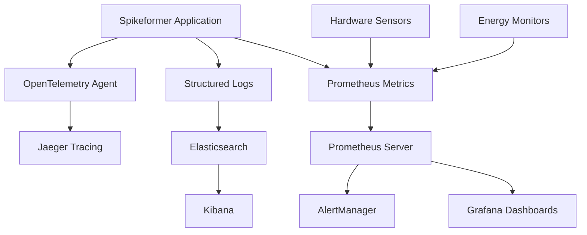

# Observability Guide for Spikeformer Neuromorphic Kit

## Overview

This guide covers comprehensive observability for the Spikeformer ecosystem, including monitoring, logging, tracing, and alerting across both software operations and neuromorphic hardware.

## Monitoring Stack

### Core Components

- **Prometheus**: Metrics collection and storage
- **Grafana**: Visualization and dashboards
- **OpenTelemetry**: Distributed tracing
- **ELK Stack**: Centralized logging (Elasticsearch, Logstash, Kibana)
- **AlertManager**: Alert routing and management

### Architecture



## Metrics Collection

### Application Metrics

**Core Performance Metrics**:
```python
from prometheus_client import Counter, Histogram, Gauge
import time

# Conversion metrics
CONVERSION_COUNTER = Counter('spikeformer_conversions_total', 
                           'Total model conversions', 
                           ['model_type', 'hardware_target'])

CONVERSION_DURATION = Histogram('spikeformer_conversion_duration_seconds',
                              'Time spent converting models',
                              ['model_size'])

ACTIVE_CONVERSIONS = Gauge('spikeformer_active_conversions',
                         'Number of active conversions')

# Usage example
@CONVERSION_DURATION.time()
def convert_model(model, target='loihi2'):
    """Convert model with metrics collection."""
    ACTIVE_CONVERSIONS.inc()
    try:
        result = perform_conversion(model, target)
        CONVERSION_COUNTER.labels(
            model_type=type(model).__name__,
            hardware_target=target
        ).inc()
        return result
    finally:
        ACTIVE_CONVERSIONS.dec()
```

**Hardware-Specific Metrics**:
```python
# Neuromorphic hardware metrics
HARDWARE_POWER = Gauge('neuromorphic_power_watts',
                      'Current power consumption',
                      ['device_type', 'chip_id'])

SPIKE_RATE = Histogram('spike_rate_hz',
                      'Spike rate distribution',
                      ['layer_name', 'neuron_type'])

ENERGY_EFFICIENCY = Gauge('energy_efficiency_ratio',
                         'Energy efficiency vs baseline',
                         ['model_name', 'hardware'])

# Loihi 2 specific metrics
LOIHI_CORE_UTILIZATION = Gauge('loihi2_core_utilization_percent',
                              'Loihi 2 core utilization',
                              ['chip_id', 'core_id'])

SYNAPSE_UPDATES = Counter('loihi2_synapse_updates_total',
                         'Total synapse updates',
                         ['learning_rule'])
```

### Custom Metrics for Neuromorphic Operations

```python
class NeuromorphicMetrics:
    """Specialized metrics for neuromorphic operations."""
    
    def __init__(self):
        self.spike_metrics = Counter('neural_spikes_total',
                                   'Total neural spikes',
                                   ['layer', 'timestep'])
        
        self.membrane_potential = Histogram('membrane_potential',
                                          'Membrane potential distribution',
                                          ['neuron_id'])
        
        self.synaptic_weight_updates = Counter('synaptic_updates_total',
                                             'Synaptic weight updates',
                                             ['synapse_type'])
    
    def record_spike(self, layer_name, timestep):
        """Record a spike event."""
        self.spike_metrics.labels(layer=layer_name, timestep=timestep).inc()
    
    def record_membrane_potential(self, neuron_id, potential):
        """Record membrane potential."""
        self.membrane_potential.labels(neuron_id=neuron_id).observe(potential)
```

## Distributed Tracing

### OpenTelemetry Configuration

```python
from opentelemetry import trace
from opentelemetry.exporter.jaeger.thrift import JaegerExporter
from opentelemetry.instrumentation.requests import RequestsInstrumentor
from opentelemetry.sdk.trace import TracerProvider
from opentelemetry.sdk.trace.export import BatchSpanProcessor

# Configure tracing
trace.set_tracer_provider(TracerProvider())
tracer = trace.get_tracer(__name__)

jaeger_exporter = JaegerExporter(
    agent_host_name="localhost",
    agent_port=6831,
)

span_processor = BatchSpanProcessor(jaeger_exporter)
trace.get_tracer_provider().add_span_processor(span_processor)

# Auto-instrument requests
RequestsInstrumentor().instrument()
```

### Tracing Neuromorphic Operations

```python
@tracer.start_as_current_span("model_conversion")
def convert_model_with_tracing(model, target_hardware):
    """Convert model with comprehensive tracing."""
    span = trace.get_current_span()
    span.set_attribute("model.type", type(model).__name__)
    span.set_attribute("model.parameters", count_parameters(model))
    span.set_attribute("hardware.target", target_hardware)
    
    with tracer.start_as_current_span("calibration") as calibration_span:
        calibration_data = prepare_calibration_data()
        calibration_span.set_attribute("calibration.samples", len(calibration_data))
    
    with tracer.start_as_current_span("layer_conversion") as layer_span:
        converted_layers = []
        for i, layer in enumerate(model.layers):
            with tracer.start_as_current_span(f"convert_layer_{i}") as l_span:
                l_span.set_attribute("layer.type", type(layer).__name__)
                converted_layer = convert_layer(layer)
                converted_layers.append(converted_layer)
    
    with tracer.start_as_current_span("hardware_compilation"):
        hardware_model = compile_for_hardware(converted_layers, target_hardware)
    
    span.set_attribute("conversion.success", True)
    return hardware_model
```

## Structured Logging

### Logging Configuration

```python
import logging
import json
from datetime import datetime

class StructuredFormatter(logging.Formatter):
    """JSON formatter for structured logging."""
    
    def format(self, record):
        log_entry = {
            'timestamp': datetime.utcnow().isoformat(),
            'level': record.levelname,
            'logger': record.name,
            'message': record.getMessage(),
            'module': record.module,
            'function': record.funcName,
            'line': record.lineno
        }
        
        # Add custom fields
        if hasattr(record, 'model_id'):
            log_entry['model_id'] = record.model_id
        if hasattr(record, 'hardware_type'):
            log_entry['hardware_type'] = record.hardware_type
        if hasattr(record, 'user_id'):
            log_entry['user_id'] = record.user_id
            
        return json.dumps(log_entry)

# Configure structured logging
def setup_logging():
    """Set up structured logging configuration."""
    logger = logging.getLogger('spikeformer')
    logger.setLevel(logging.INFO)
    
    handler = logging.StreamHandler()
    handler.setFormatter(StructuredFormatter())
    logger.addHandler(handler)
    
    return logger

logger = setup_logging()
```

### Neuromorphic-Specific Logging

```python
class NeuromorphicLogger:
    """Specialized logger for neuromorphic operations."""
    
    def __init__(self):
        self.logger = logging.getLogger('spikeformer.neuromorphic')
    
    def log_conversion_start(self, model_info, hardware_target):
        """Log conversion process start."""
        self.logger.info(
            "Starting model conversion",
            extra={
                'event_type': 'conversion_start',
                'model_id': model_info.get('id'),
                'model_type': model_info.get('type'),
                'model_size': model_info.get('parameter_count'),
                'hardware_target': hardware_target,
                'timestamp': datetime.utcnow().isoformat()
            }
        )
    
    def log_spike_activity(self, layer_name, spike_count, timestep):
        """Log spike activity for analysis."""
        self.logger.debug(
            "Spike activity recorded",
            extra={
                'event_type': 'spike_activity',
                'layer_name': layer_name,
                'spike_count': spike_count,
                'timestep': timestep,
                'spike_rate': spike_count / timestep if timestep > 0 else 0
            }
        )
    
    def log_hardware_error(self, hardware_type, error_details):
        """Log hardware-related errors."""
        self.logger.error(
            "Hardware error encountered",
            extra={
                'event_type': 'hardware_error',
                'hardware_type': hardware_type,
                'error_message': str(error_details),
                'requires_attention': True
            }
        )
```

## Health Checks

### Application Health Endpoints

```python
from flask import Flask, jsonify
import psutil
import torch

app = Flask(__name__)

@app.route('/health')
def health_check():
    """Basic health check endpoint."""
    return jsonify({
        'status': 'healthy',
        'timestamp': datetime.utcnow().isoformat(),
        'version': get_version()
    })

@app.route('/health/detailed')
def detailed_health_check():
    """Detailed health check with system metrics."""
    gpu_available = torch.cuda.is_available()
    gpu_count = torch.cuda.device_count() if gpu_available else 0
    
    health_data = {
        'status': 'healthy',
        'timestamp': datetime.utcnow().isoformat(),
        'system': {
            'cpu_percent': psutil.cpu_percent(interval=1),
            'memory_percent': psutil.virtual_memory().percent,
            'disk_usage': psutil.disk_usage('/').percent,
            'gpu_available': gpu_available,
            'gpu_count': gpu_count
        },
        'hardware': {
            'loihi2_connected': check_loihi2_connection(),
            'spinnaker_connected': check_spinnaker_connection()
        },
        'services': {
            'prometheus': check_prometheus_connection(),
            'database': check_database_connection()
        }
    }
    
    # Determine overall health
    overall_status = 'healthy'
    if health_data['system']['memory_percent'] > 90:
        overall_status = 'degraded'
    if not any(health_data['hardware'].values()):
        overall_status = 'degraded'
    
    health_data['status'] = overall_status
    return jsonify(health_data)

@app.route('/metrics')
def metrics_endpoint():
    """Prometheus metrics endpoint."""
    from prometheus_client import generate_latest
    return generate_latest(), 200, {'Content-Type': 'text/plain'}
```

### Hardware Health Monitoring

```python
class HardwareHealthMonitor:
    """Monitor neuromorphic hardware health."""
    
    def __init__(self):
        self.health_metrics = {
            'loihi2': Gauge('loihi2_health_status', 'Loihi 2 health status'),
            'spinnaker': Gauge('spinnaker_health_status', 'SpiNNaker health status')
        }
    
    async def monitor_hardware_health(self):
        """Continuously monitor hardware health."""
        while True:
            try:
                # Check Loihi 2
                loihi2_status = await self.check_loihi2_health()
                self.health_metrics['loihi2'].set(1 if loihi2_status else 0)
                
                # Check SpiNNaker
                spinnaker_status = await self.check_spinnaker_health()
                self.health_metrics['spinnaker'].set(1 if spinnaker_status else 0)
                
                await asyncio.sleep(30)  # Check every 30 seconds
                
            except Exception as e:
                logger.error(f"Hardware health check failed: {e}")
                await asyncio.sleep(60)  # Longer delay on error
    
    async def check_loihi2_health(self):
        """Check Loihi 2 hardware health."""
        try:
            from spikeformer.hardware.loihi2 import Loihi2Device
            device = Loihi2Device()
            return device.ping()  # Simple connectivity check
        except Exception:
            return False
    
    async def check_spinnaker_health(self):
        """Check SpiNNaker hardware health."""
        try:
            from spikeformer.hardware.spinnaker import SpiNNakerDevice
            device = SpiNNakerDevice()
            return device.is_alive()
        except Exception:
            return False
```

## Alerting Rules

### Prometheus Alerting Rules

```yaml
# monitoring/alert_rules.yml
groups:
  - name: spikeformer.rules
    rules:
      # High error rate
      - alert: HighConversionErrorRate
        expr: rate(spikeformer_conversion_errors_total[5m]) > 0.1
        for: 2m
        labels:
          severity: warning
        annotations:
          summary: "High conversion error rate detected"
          description: "Conversion error rate is {{ $value }} errors per second"
      
      # Hardware disconnection
      - alert: HardwareDisconnected
        expr: loihi2_health_status == 0 or spinnaker_health_status == 0
        for: 1m
        labels:
          severity: critical
        annotations:
          summary: "Neuromorphic hardware disconnected"
          description: "Hardware {{ $labels.instance }} is not responding"
      
      # High memory usage
      - alert: HighMemoryUsage
        expr: (node_memory_MemTotal_bytes - node_memory_MemAvailable_bytes) / node_memory_MemTotal_bytes > 0.9
        for: 5m
        labels:
          severity: warning
        annotations:
          summary: "High memory usage"
          description: "Memory usage is above 90%"
      
      # Energy efficiency degradation
      - alert: EnergyEfficiencyDegraded
        expr: energy_efficiency_ratio < 5
        for: 10m
        labels:
          severity: warning
        annotations:
          summary: "Energy efficiency below threshold"
          description: "Energy efficiency ratio is {{ $value }}, expected > 5x"
```

### Alert Manager Configuration

```yaml
# monitoring/alert_manager.yml
global:
  smtp_smarthost: 'localhost:587'
  smtp_from: 'alerts@spikeformer.ai'

route:
  group_by: ['alertname']
  group_wait: 10s
  group_interval: 10s
  repeat_interval: 1h
  receiver: 'default'
  routes:
    - match:
        severity: critical
      receiver: 'critical-alerts'
    - match:
        alertname: HardwareDisconnected
      receiver: 'hardware-team'

receivers:
  - name: 'default'
    email_configs:
      - to: 'team@spikeformer.ai'
        subject: 'Spikeformer Alert: {{ .GroupLabels.alertname }}'
        body: |
          {{ range .Alerts }}
          Alert: {{ .Annotations.summary }}
          Description: {{ .Annotations.description }}
          {{ end }}
  
  - name: 'critical-alerts'
    email_configs:
      - to: 'oncall@spikeformer.ai'
        subject: 'CRITICAL: {{ .GroupLabels.alertname }}'
    slack_configs:
      - api_url: 'https://hooks.slack.com/services/YOUR/SLACK/WEBHOOK'
        channel: '#alerts'
        title: 'Critical Alert'
        text: '{{ range .Alerts }}{{ .Annotations.summary }}{{ end }}'
  
  - name: 'hardware-team'
    email_configs:
      - to: 'hardware-team@spikeformer.ai'
        subject: 'Hardware Alert: {{ .GroupLabels.alertname }}'
```

## Grafana Dashboards

### Main Application Dashboard

```json
{
  "dashboard": {
    "title": "Spikeformer Overview",
    "panels": [
      {
        "title": "Conversion Rate",
        "type": "stat",
        "targets": [
          {
            "expr": "rate(spikeformer_conversions_total[5m])",
            "legendFormat": "Conversions/sec"
          }
        ]
      },
      {
        "title": "Active Conversions",
        "type": "gauge",
        "targets": [
          {
            "expr": "spikeformer_active_conversions",
            "legendFormat": "Active"
          }
        ]
      },
      {
        "title": "Hardware Status",
        "type": "stat",
        "targets": [
          {
            "expr": "loihi2_health_status",
            "legendFormat": "Loihi 2"
          },
          {
            "expr": "spinnaker_health_status",
            "legendFormat": "SpiNNaker"
          }
        ]
      },
      {
        "title": "Energy Efficiency Trends",
        "type": "timeseries",
        "targets": [
          {
            "expr": "energy_efficiency_ratio",
            "legendFormat": "{{model_name}} on {{hardware}}"
          }
        ]
      }
    ]
  }
}
```

### Hardware-Specific Dashboard

```json
{
  "dashboard": {
    "title": "Neuromorphic Hardware Monitoring",
    "panels": [
      {
        "title": "Loihi 2 Core Utilization",
        "type": "heatmap",
        "targets": [
          {
            "expr": "loihi2_core_utilization_percent",
            "legendFormat": "Chip {{chip_id}} Core {{core_id}}"
          }
        ]
      },
      {
        "title": "Power Consumption",
        "type": "timeseries",
        "targets": [
          {
            "expr": "neuromorphic_power_watts",
            "legendFormat": "{{device_type}} {{chip_id}}"
          }
        ]
      },
      {
        "title": "Spike Rate Distribution",
        "type": "histogram",
        "targets": [
          {
            "expr": "spike_rate_hz",
            "legendFormat": "{{layer_name}}"
          }
        ]
      }
    ]
  }
}
```

## Performance Monitoring

### Continuous Performance Benchmarking

```python
import asyncio
from datetime import datetime, timedelta

class PerformanceBenchmark:
    """Continuous performance benchmarking system."""
    
    def __init__(self):
        self.benchmark_models = [
            'vit-tiny', 'vit-small', 'vit-base',
            'bert-tiny', 'bert-base'
        ]
        self.hardware_targets = ['loihi2', 'spinnaker', 'cpu']
    
    async def run_continuous_benchmarks(self):
        """Run performance benchmarks continuously."""
        while True:
            try:
                for model in self.benchmark_models:
                    for hardware in self.hardware_targets:
                        await self.benchmark_model_hardware(model, hardware)
                
                # Run every 6 hours
                await asyncio.sleep(6 * 3600)
                
            except Exception as e:
                logger.error(f"Benchmark run failed: {e}")
                await asyncio.sleep(3600)  # Retry in 1 hour
    
    async def benchmark_model_hardware(self, model_name, hardware):
        """Benchmark specific model-hardware combination."""
        start_time = datetime.utcnow()
        
        try:
            # Load model
            model = load_benchmark_model(model_name)
            
            # Convert and deploy
            converter = SpikeformerConverter()
            spiking_model = converter.convert(model)
            
            if hardware != 'cpu':
                deployed_model = deploy_to_hardware(spiking_model, hardware)
            else:
                deployed_model = spiking_model
            
            # Run benchmark
            results = await run_inference_benchmark(deployed_model)
            
            # Record metrics
            self.record_benchmark_results(model_name, hardware, results)
            
        except Exception as e:
            logger.error(f"Benchmark failed for {model_name} on {hardware}: {e}")
        
        duration = (datetime.utcnow() - start_time).total_seconds()
        logger.info(f"Benchmark completed in {duration:.2f}s")
    
    def record_benchmark_results(self, model, hardware, results):
        """Record benchmark results as metrics."""
        BENCHMARK_ACCURACY.labels(model=model, hardware=hardware).set(results['accuracy'])
        BENCHMARK_LATENCY.labels(model=model, hardware=hardware).set(results['latency'])
        BENCHMARK_ENERGY.labels(model=model, hardware=hardware).set(results['energy'])
        BENCHMARK_THROUGHPUT.labels(model=model, hardware=hardware).set(results['throughput'])
```

## Log Analysis and Insights

### Automated Log Analysis

```python
class LogAnalyzer:
    """Analyze logs for patterns and insights."""
    
    def __init__(self):
        self.elasticsearch = Elasticsearch(['localhost:9200'])
    
    def analyze_conversion_patterns(self, time_range='1h'):
        """Analyze conversion patterns and identify issues."""
        query = {
            'query': {
                'bool': {
                    'must': [
                        {'match': {'event_type': 'conversion_start'}},
                        {'range': {'timestamp': {'gte': f'now-{time_range}'}}}
                    ]
                }
            },
            'aggs': {
                'by_model_type': {
                    'terms': {'field': 'model_type.keyword'}
                },
                'by_hardware': {
                    'terms': {'field': 'hardware_target.keyword'}
                }
            }
        }
        
        response = self.elasticsearch.search(index='spikeformer-logs', body=query)
        return self.process_analysis_results(response)
    
    def detect_anomalies(self):
        """Detect anomalies in system behavior."""
        # Implement anomaly detection logic
        anomalies = []
        
        # Check for unusual error patterns
        error_query = {
            'query': {
                'bool': {
                    'must': [
                        {'match': {'level': 'ERROR'}},
                        {'range': {'timestamp': {'gte': 'now-1h'}}}
                    ]
                }
            },
            'aggs': {
                'error_count': {'value_count': {'field': 'timestamp'}}
            }
        }
        
        error_response = self.elasticsearch.search(index='spikeformer-logs', body=error_query)
        error_count = error_response['aggregations']['error_count']['value']
        
        if error_count > 10:  # Threshold
            anomalies.append({
                'type': 'high_error_rate',
                'count': error_count,
                'severity': 'warning'
            })
        
        return anomalies
```

This comprehensive observability setup provides complete visibility into the Spikeformer system, from application performance to neuromorphic hardware health, enabling proactive monitoring and rapid issue resolution.