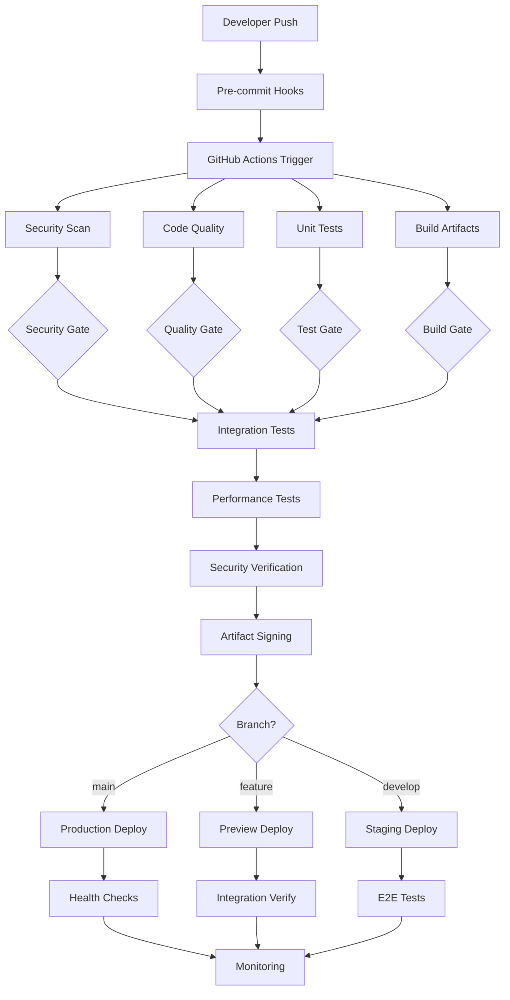

# CI/CD Architecture and Workflows

## Overview

This document outlines the comprehensive CI/CD architecture for the Spikeformer Neuromorphic Kit, designed to support secure, efficient, and reliable software delivery.

## Architecture Principles

### 1. Security-First Approach
- SLSA Level 2+ compliance
- Signed artifacts and provenance
- Comprehensive security scanning
- Secret management best practices

### 2. Quality Gates
- Automated testing at multiple levels
- Code quality enforcement
- Performance benchmarking
- Security vulnerability assessment

### 3. Deployment Strategies
- Blue-green deployments
- Canary releases
- Feature flag integration
- Rollback capabilities

### 4. Observability
- Comprehensive logging
- Metrics collection
- Distributed tracing
- Alert management

## Workflow Architecture



## Workflow Definitions

### 1. Continuous Integration (CI)

#### Trigger Events
- **Push to main**: Full CI/CD pipeline
- **Pull Request**: CI validation without deployment
- **Tag creation**: Release pipeline
- **Scheduled**: Nightly security scans and dependency updates

#### CI Stages

**Stage 1: Security and Quality (Parallel)**
```yaml
# .github/workflows/ci.yml (Reference - implement manually)
name: Continuous Integration

on:
  push:
    branches: [main, develop]
  pull_request:
    branches: [main, develop]

jobs:
  security-scan:
    runs-on: ubuntu-latest
    steps:
      - uses: actions/checkout@v4
      - name: Run security scan
        run: |
          bandit -r spikeformer/ -f json -o security-report.json
          safety check --json --output safety-report.json
          
  code-quality:
    runs-on: ubuntu-latest
    steps:
      - uses: actions/checkout@v4
      - name: Code quality checks
        run: |
          ruff check spikeformer/
          black --check spikeformer/
          mypy spikeformer/
```

**Stage 2: Testing (Sequential)**
```yaml
  unit-tests:
    runs-on: ubuntu-latest
    needs: [security-scan, code-quality]
    steps:
      - name: Run unit tests
        run: pytest tests/unit/ --cov=spikeformer --cov-report=xml
        
  integration-tests:
    runs-on: ubuntu-latest
    needs: unit-tests
    steps:
      - name: Run integration tests
        run: pytest tests/integration/ --maxfail=5
        
  performance-tests:
    runs-on: ubuntu-latest
    needs: integration-tests
    steps:
      - name: Run performance benchmarks
        run: pytest tests/performance/ --benchmark-only
```

**Stage 3: Build and Package**
```yaml
  build:
    runs-on: ubuntu-latest
    needs: [unit-tests, integration-tests]
    outputs:
      image-digest: ${{ steps.build.outputs.digest }}
    steps:
      - name: Build Docker image
        id: build
        run: |
          docker build -t spikeformer:${{ github.sha }} .
          echo "digest=$(docker inspect --format='{{index .RepoDigests 0}}' spikeformer:${{ github.sha }})" >> $GITHUB_OUTPUT
          
      - name: Generate SBOM
        run: python scripts/generate_sbom.py
        
      - name: Sign artifacts
        run: cosign sign --yes spikeformer:${{ github.sha }}
```

### 2. Continuous Deployment (CD)

#### Deployment Environments

**Staging Environment**
- Triggered by: Push to `develop` branch
- Purpose: Integration testing and validation
- Hardware: Simulated neuromorphic backends
- Data: Synthetic datasets

**Production Environment**
- Triggered by: Push to `main` branch or release tag
- Purpose: Live user traffic
- Hardware: Real Loihi 2 and SpiNNaker systems
- Data: Production datasets

#### Deployment Strategies

**Blue-Green Deployment**
```yaml
  deploy-production:
    runs-on: ubuntu-latest
    environment: production
    steps:
      - name: Deploy to Green Environment
        run: |
          kubectl set image deployment/spikeformer-api \
            api=spikeformer:${{ github.sha }} \
            --namespace=spikeformer-green
            
      - name: Health Check Green
        run: |
          ./scripts/health_check.sh spikeformer-green
          
      - name: Switch Traffic to Green
        run: |
          kubectl patch service spikeformer-api \
            -p '{"spec":{"selector":{"environment":"green"}}}' \
            --namespace=spikeformer
            
      - name: Monitor Metrics
        run: |
          ./scripts/deployment_monitor.sh --duration=300
          
      - name: Cleanup Blue Environment
        if: success()
        run: |
          kubectl delete deployment spikeformer-api \
            --namespace=spikeformer-blue
```

**Canary Deployment**
```yaml
  canary-deploy:
    runs-on: ubuntu-latest
    if: contains(github.event.head_commit.message, '[canary]')
    steps:
      - name: Deploy 10% Canary
        run: |
          kubectl apply -f k8s/canary-10percent.yaml
          
      - name: Monitor Canary Metrics
        run: |
          ./scripts/canary_monitor.sh --percentage=10 --duration=600
          
      - name: Promote to 50% or Rollback
        run: |
          if ./scripts/canary_health_check.sh; then
            kubectl apply -f k8s/canary-50percent.yaml
          else
            kubectl delete -f k8s/canary-10percent.yaml
          fi
```

### 3. Release Pipeline

#### Release Workflow
```yaml
  release:
    runs-on: ubuntu-latest
    if: startsWith(github.ref, 'refs/tags/')
    steps:
      - name: Create Release Artifacts
        run: |
          python setup.py sdist bdist_wheel
          docker build -t spikeformer:${{ github.ref_name }} .
          
      - name: Generate Release Notes
        run: |
          ./scripts/generate_release_notes.sh ${{ github.ref_name }}
          
      - name: Publish to PyPI
        run: |
          twine upload dist/*
          
      - name: Push Docker Images
        run: |
          docker push spikeformer:${{ github.ref_name }}
          docker push spikeformer:latest
          
      - name: Create GitHub Release
        uses: actions/create-release@v1
        with:
          tag_name: ${{ github.ref }}
          release_name: Release ${{ github.ref }}
          body_path: release-notes.md
```

## Security Integration

### 1. SLSA Compliance

**Provenance Generation**
```yaml
  provenance:
    runs-on: ubuntu-latest
    needs: build
    permissions:
      id-token: write
      contents: read
    steps:
      - name: Generate SLSA Provenance
        uses: slsa-framework/slsa-github-generator/.github/workflows/generator_generic_slsa3.yml@v1.7.0
        with:
          base64-subjects: "${{ needs.build.outputs.hashes }}"
```

**Verification Requirements**
- All artifacts must have SLSA provenance
- Signatures verified before deployment
- Supply chain attestations required

### 2. Security Scanning Integration

**Multi-Layer Security**
```yaml
  security-comprehensive:
    runs-on: ubuntu-latest
    steps:
      - name: Source Code Security
        run: |
          bandit -r spikeformer/ -f json -o bandit-report.json
          semgrep --config=auto --json --output=semgrep-report.json
          
      - name: Dependency Security
        run: |
          safety check --json --output=safety-report.json
          pip-audit --format=json --output=pip-audit-report.json
          
      - name: Container Security
        run: |
          trivy image --format json --output trivy-report.json spikeformer:latest
          
      - name: SBOM Generation
        run: |
          python scripts/generate_sbom.py
          syft spikeformer:latest -o spdx-json > sbom.spdx.json
```

## Infrastructure as Code

### 1. Kubernetes Manifests

**Production Deployment**
```yaml
# k8s/production/deployment.yaml
apiVersion: apps/v1
kind: Deployment
metadata:
  name: spikeformer-api
  namespace: spikeformer
spec:
  replicas: 3
  selector:
    matchLabels:
      app: spikeformer-api
  template:
    metadata:
      labels:
        app: spikeformer-api
    spec:
      containers:
      - name: api
        image: spikeformer:latest
        ports:
        - containerPort: 8000
        env:
        - name: ENVIRONMENT
          value: "production"
        resources:
          requests:
            memory: "1Gi"
            cpu: "500m"
          limits:
            memory: "2Gi"
            cpu: "1000m"
        livenessProbe:
          httpGet:
            path: /health
            port: 8000
          initialDelaySeconds: 30
          periodSeconds: 10
        readinessProbe:
          httpGet:
            path: /ready
            port: 8000
          initialDelaySeconds: 5
          periodSeconds: 5
```

### 2. Monitoring Configuration

**Prometheus Configuration**
```yaml
# monitoring/production/prometheus.yml
global:
  scrape_interval: 15s
  evaluation_interval: 15s

rule_files:
  - "alert_rules.yml"

scrape_configs:
  - job_name: 'spikeformer-api'
    kubernetes_sd_configs:
    - role: endpoints
    relabel_configs:
    - source_labels: [__meta_kubernetes_service_label_app]
      action: keep
      regex: spikeformer-api
```

## Deployment Environments

### 1. Development Environment
- **Purpose**: Local development and testing
- **Infrastructure**: Docker Compose
- **Data**: Mock/synthetic datasets
- **Hardware**: Simulated neuromorphic backends
- **Monitoring**: Basic logging and metrics

### 2. Staging Environment
- **Purpose**: Pre-production validation
- **Infrastructure**: Kubernetes cluster (similar to prod)
- **Data**: Production-like datasets (anonymized)
- **Hardware**: Limited neuromorphic hardware access
- **Monitoring**: Full observability stack

### 3. Production Environment
- **Purpose**: Live user traffic
- **Infrastructure**: High-availability Kubernetes
- **Data**: Production datasets
- **Hardware**: Full neuromorphic hardware access
- **Monitoring**: Complete observability with alerting

## Rollback Procedures

### 1. Automated Rollback Triggers
- Error rate > 5% for 5 minutes
- Response time > 2x baseline for 10 minutes
- Health check failures > 50%
- Critical security alert

### 2. Manual Rollback Process
```bash
# Quick rollback to previous version
kubectl rollout undo deployment/spikeformer-api --namespace=spikeformer

# Rollback to specific version
kubectl rollout undo deployment/spikeformer-api --to-revision=5 --namespace=spikeformer

# Verify rollback
kubectl rollout status deployment/spikeformer-api --namespace=spikeformer
```

## Performance and Scalability

### 1. Auto-scaling Configuration
```yaml
apiVersion: autoscaling/v2
kind: HorizontalPodAutoscaler
metadata:
  name: spikeformer-api-hpa
spec:
  scaleTargetRef:
    apiVersion: apps/v1
    kind: Deployment
    name: spikeformer-api
  minReplicas: 3
  maxReplicas: 20
  metrics:
  - type: Resource
    resource:
      name: cpu
      target:
        type: Utilization
        averageUtilization: 70
  - type: Resource
    resource:
      name: memory
      target:
        type: Utilization
        averageUtilization: 80
```

### 2. Load Testing Integration
```yaml
  load-testing:
    runs-on: ubuntu-latest
    needs: deploy-staging
    steps:
      - name: Run Load Tests
        run: |
          locust -f tests/load/locustfile.py \
            --host=https://staging.spikeformer.com \
            --users=100 --spawn-rate=10 \
            --run-time=300s --html=load-test-report.html
            
      - name: Analyze Results
        run: |
          python scripts/analyze_load_test.py load-test-report.html
```

## Compliance and Governance

### 1. Audit Trail
- All deployments logged with user, timestamp, and artifacts
- Change approvals tracked
- Security scan results archived
- Performance metrics retained

### 2. Compliance Checks
- SLSA provenance verification
- Security policy enforcement
- Data privacy compliance
- License compliance verification

### 3. Governance Gates
- Required approvals for production deployments
- Security team sign-off for high-risk changes
- Performance benchmark validation
- Documentation update requirements

## Troubleshooting and Support

### 1. Common Issues
- **Build Failures**: Check dependency conflicts, test failures
- **Deployment Failures**: Verify resource constraints, configuration
- **Performance Issues**: Check scaling configuration, resource limits
- **Security Alerts**: Review security scan results, update dependencies

### 2. Support Contacts
- **CI/CD Issues**: DevOps team
- **Security Concerns**: Security team
- **Performance Problems**: Platform team
- **Hardware Integration**: Hardware team

---

*This CI/CD architecture is designed to evolve with the project's needs while maintaining security, quality, and reliability standards.*